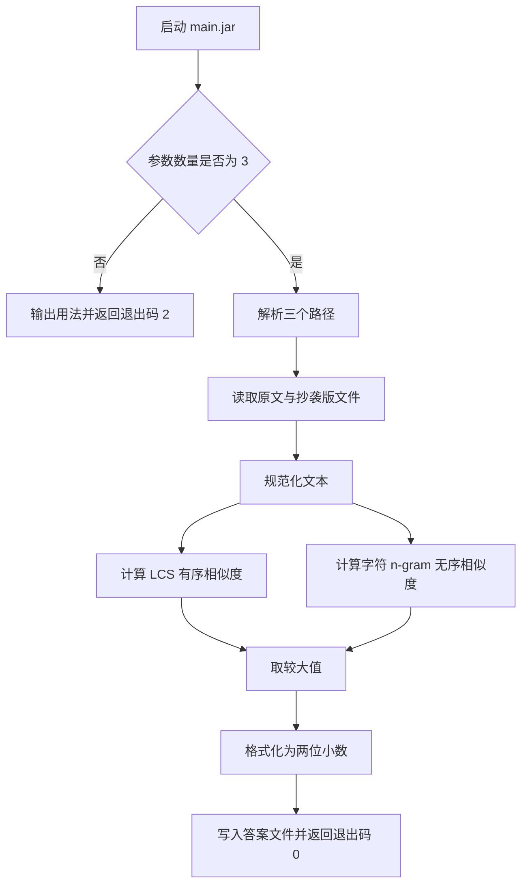
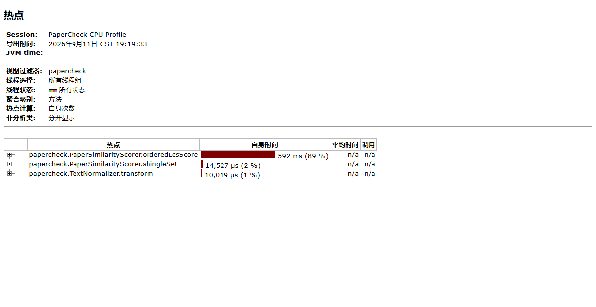
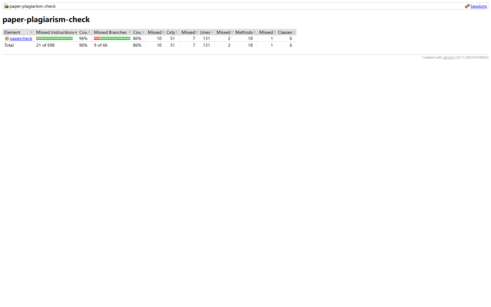
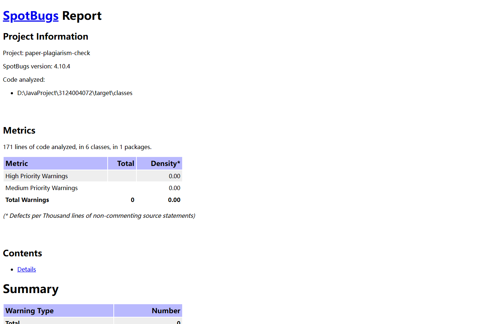

作业 GitHub 仓库：[https://github.com/flanklinyang/flanklinyang](https://github.com/flanklinyang/flanklinyang)

# 第一次个人编程作业：论文查重

学号：`3124004072`

## 一、作业任务

本次作业要求实现一个论文查重程序。程序接收三个命令行参数：

```text
java -jar main.jar <原文文件> <抄袭版论文文件> <答案文件>
```

程序读取原文和抄袭版论文，计算两者的重复率，并把结果以保留两位小数的浮点数写入答案文件。

例如：

```text
java -jar main.jar C:\tests\orig.txt C:\tests\orig_add.txt C:\tests\ans.txt
```

答案文件中的内容形如：

```text
0.81
```

## 二、需求分析

程序需要满足以下功能和非功能要求：

1. 使用 Java 实现，并提供可直接运行的 `main.jar`。
2. 从命令行读取原文、抄袭版论文和答案文件三个绝对路径。
3. 支持中文和英文文本，不依赖联网服务和外部分词程序。
4. 能识别增、删、改等局部修改造成的相似内容。
5. 能处理段落顺序发生变化的相似内容。
6. 答案必须位于 `0.00` 到 `1.00` 之间，并保留两位小数。
7. 对错误的参数数量、无效路径、输入文件不存在等情况进行异常处理。
8. 不连接网络，不访问命令行参数之外的业务文件。
9. 在评测限制下保持较低的内存占用和稳定的运行时间。

## 三、PSP 时间记录

| PSP2.1 | 阶段 | 预估耗时（分钟） | 实际耗时（分钟） |
| --- | --- | ---: | ---: |
| Planning | 计划 | - | - |
| Estimate | 估计任务所需时间 | 20 | 20 |
| Development | 开发 | - | - |
| Analysis | 需求分析，包括学习新技术 | 60 | 70 |
| Design Spec | 生成设计文档 | 60 | 75 |
| Design Review | 设计复审 | 30 | 25 |
| Coding Standard | 代码规范 | 20 | 20 |
| Design | 具体设计 | 60 | 60 |
| Coding | 具体编码 | 240 | 300 |
| Code Review | 代码复审 | 45 | 40 |
| Test | 测试，包括修改代码和提交 | 120 | 180 |
| Reporting | 报告 | - | - |
| Test Report | 测试报告 | 45 | 35 |
| Size Measurement | 计算工作量 | 15 | 15 |
| Postmortem & Process Improvement Plan | 事后总结和改进计划 | 30 | 25 |
| 合计 |  | 745 | 865 |

说明：实际耗时按项目设计、编码、测试、性能分析、代码检查和文档整理过程汇总。

## 四、开发环境与项目结构

开发环境：

- 编译目标：Java 8（Java 8 及以上运行）
- 构建工具：Maven
- 单元测试：JUnit 4.12
- 覆盖率：JaCoCo 0.8.11
- 代码质量：SpotBugs 4.10.4.1
- 运行方式：命令行
- 程序入口：`papercheck.Main`

项目结构：

```text
3124004072/
├─ main.jar
├─ pom.xml
├─ README.md
├─ sample/
│  ├─ orig.txt
│  ├─ copied.txt
│  └─ ans.txt
└─ src/
   ├─ main/java/papercheck/
   │  ├─ Main.java
   │  ├─ PlagiarismCheckerApp.java
   │  ├─ PaperSimilarityScorer.java
   │  ├─ TextNormalizer.java
   │  ├─ TextFileReader.java
   │  └─ AnswerFileWriter.java
   └─ test/java/papercheck/
      ├─ PaperSimilarityScorerTest.java
      └─ CommandLineRunnerTest.java
```

## 五、模块接口设计

### 5.1 总体调用关系

程序按“入口、流程控制、文本读取、相似度计算、结果写出”拆分模块：

```text
Main
  |
  v
PlagiarismCheckerApp
  |-- TextFileReader.read()
  |-- PaperSimilarityScorer.score()
  |     |-- TextNormalizer.normalize()
  |     |-- TextNormalizer.normalizeKeepingLayout()
  |     |-- orderedLcsScore()
  |     `-- unorderedShingleScore()
  `-- AnswerFileWriter.write()
```

各模块只承担单一职责：

| 类 | 主要职责 |
| --- | --- |
| `Main` | 命令行入口，调用应用层并获得退出码 |
| `PlagiarismCheckerApp` | 参数校验、文件读取、算法调用和异常转换 |
| `TextFileReader` | 只读取命令行指定的输入文件，统一换行和去除 BOM |
| `TextNormalizer` | 对大小写、全角 ASCII、标点和空白进行规范化 |
| `PaperSimilarityScorer` | 计算最终相似度 |
| `AnswerFileWriter` | 将结果格式化为两位小数并写往指定路径 |

### 5.2 核心接口

```java
public double score(CharSequence originalText, CharSequence copiedText);
```

该接口返回 `[0.0, 1.0]` 范围内的重复率。输入为空时返回 `0.0`，完全一致时返回 `1.0`。

## 六、算法设计

### 6.1 文本规范化

算法把文本转换为 Unicode 码点数组，避免直接按 Java `char` 处理时拆开代理对字符串。

程序使用两种规范化结果：

1. 无序比较形式：只保留字母和数字，统一转为小写，并将全角 ASCII 转为半角 ASCII。
2. 保序比较形式：保留下标、标点和空白，仅统一大小写和全角 ASCII。

第一种形式用于比较字符片段集合，第二种形式用于保留标点等顺序锚点。

### 6.2 基于 LCS 的有序相似度

最长公共子序列能够保留字符的先后顺序，对局部插入、删除和替换比较敏感。

设原文长度为 `m`，抄袭版长度为 `n`，最长公共子序列长度为 `LCS(m,n)`，有序相似度为：

```text
orderedScore = 2 * LCS(m,n) / (m + n)
```

当两段文本完全一致时：

```text
2 * m / (m + m) = 1
```

当两段文本完全不同时，LCS 为 0，结果为 0。

传统二维动态规划需要 `O(m*n)` 内存。本项目只保留当前行和上一行，因此时间复杂度仍为 `O(m*n)`，辅助空间降低为 `O(min(m,n))`。

动态规划核心状态为：

```text
dp[i][j] = 原文前 i 个字符与抄袭版前 j 个字符的 LCS 长度
```

递推关系：

```text
字符相同：dp[i][j] = dp[i-1][j-1] + 1
字符不同：dp[i][j] = max(dp[i-1][j], dp[i][j-1])
```

为了规避极端输入导致计算时间过长，当 `m*n` 超过 2500 万时跳过 LCS 计算。程序仍会执行字符 n-gram 相似度计算，从而保证程序能够及时输出结果。

### 6.3 基于字符 n-gram 的无序相似度

为了处理段落重排，本项目提取长度为 3、4、5、6 的连续字符片段。每个长度对应的权重为：

| n-gram 长度 | 权重 |
| ---: | ---: |
| 3 | 0.20 |
| 4 | 0.30 |
| 5 | 0.30 |
| 6 | 0.20 |

较短片段对局部改动更敏感，较长片段更能体现稳定内容，因此采用组合权重。

对每组 n-gram，使用 Dice 系数计算相似度：

```text
dice = 2 * |A ∩ B| / (|A| + |B|)
```

其中 `A` 和 `B` 分别是原文与抄袭版的 n-gram 集合。

若直接截取每个子串，会产生大量临时字符串。本项目使用多项式滚动哈希，将每个 n-gram 映射为 `long`：

```text
H = c0 * B^(n-1) + c1 * B^(n-2) + ... + c(n-1)
```

滑动到下一片段时，只需去掉最高位字符并加入新字符：

```text
H(next) = H(current) * B + newCodePoint
          - B^n * removedCodePoint
```

这样无需为每个窗口创建字符串，降低了时间和内存开销。

### 6.4 最终相似度

有序相似度与无序相似度分别解决不同类型的问题，因此最终结果取二者较大值：

```text
score = max(orderedScore, unorderedScore)
```

LCS 侧重同序内容，n-gram 侧重内容集合。取最大值可以减少段落顺序调整、少量增删改对最终结果造成的漏判。

### 6.5 算法复杂度

| 步骤 | 时间复杂度 | 辅助空间复杂度 |
| --- | --- | --- |
| 文本规范化 | `O(m+n)` | `O(m+n)` |
| LCS 滚动数组 | `O(m*n)`，超限时跳过 | `O(min(m,n))` |
| 3 至 6 字符 n-gram | 期望 `O(m+n)` | `O(m+n)` |
| 集合求交 | 与较短集合大小相关 | `O(1)` 额外空间 |

### 6.6 算法特点

1. 不依赖中文分词库，可以直接处理中文、英文以及中英混合文本。
2. 同时考虑字符顺序和字符片段集合，能覆盖局部修改与段落重排。
3. 使用码点而不是 UTF-16 代码单元，避免非基本平面字符被错误拆分。
4. LCS 使用滚动数组，显著降低长文本的内存占用。
5. n-gram 使用滚动哈希，避免生成大量临时子串。
6. 对超大 LCS 计算设置上限，优先保证程序在评测时间内返回结果。

## 七、程序流程



## 八、性能分析与改进

### 8.1 第一版思路

第一版可采用完整二维 LCS 表，并通过对字符串调用 `substring` 生成所有 n-gram。这种方式容易理解，但在长文本下有两个问题：

1. 二维 LCS 表需要 `O(m*n)` 内存，两个长文本同时出现时内存增长很快。
2. 每个 n-gram 都创建字符串对象，会增加垃圾回收和数据复制开销。

### 8.2 改进措施

| 改进项 | 改进前 | 改进后 | 效果 |
| --- | --- | --- | --- |
| LCS 存储 | 完整二维数组 | 两个一维数组滚动更新 | 内存从 `O(m*n)` 降到 `O(min(m,n))` |
| n-gram 生成 | 截取子串并保存字符串 | 多项式滚动哈希并保存 `long` | 避免大量临时字符串 |
| 文本处理 | 按 UTF-16 字符处理 | 按 Unicode 码点处理 | 正确支持补充平面字符 |
| 极端长文本 | 始终执行完整 LCS | 超过 2500 万计算单元时跳过 LCS | 控制运行时间，降低超时风险 |
| 相似度判断 | 只使用一种指标 | 有序 LCS 与无序 n-gram 组合 | 同时覆盖局部修改和段落重排 |

### 8.3 性能分析结果

使用 JProfiler 16.2.1 对程序执行 CPU Sampling 分析，采样间隔为 5 ms。
分析入口重复调用相似度计算模块 30 次，输入为中规模样例。CPU Hot Spots
按 Self Time 排序的结果如下：



图 1：JProfiler CPU Hot Spots 分析结果。

从分析结果可以看到：

- `PaperSimilarityScorer.orderedLcsScore` 自身时间约 `592 ms`，占 `89%`，是最大的 CPU 热点。
- `PaperSimilarityScorer.shingleSet` 自身时间约 `14.527 ms`，占 `2%`。
- `TextNormalizer.transform` 自身时间约 `10.019 ms`，占 `1%`。

需要重点观察以下方法：

- `PaperSimilarityScorer.orderedLcsScore`
- `PaperSimilarityScorer.unorderedShingleScore`
- `PaperSimilarityScorer.shingleSet`

该结果与算法复杂度分析一致。LCS 在未达到计算量上限时执行
`O(m*n)` 的动态规划，是长文本下的主要热点；滚动数组降低了内存占用，
但不会降低该部分的时间复杂度。n-gram 使用滚动哈希和集合比较，
在本次输入中不是主要瓶颈。

### 8.4 性能测试结果

对每个场景运行 5 次，取中位数。运行时间包含 JVM 启动和文件读写时间，
峰值内存通过独立 Java 进程的 `PeakWorkingSet64` 记录：

| 场景 | 原文规模 | 抄袭版规模 | 修改类型 | 运行时间 | 峰值内存 |
| --- | ---: | ---: | --- | ---: | ---: |
| 小规模样例 | 22 字符 | 20 字符 | 局部替换 | 156.6 ms | 37.4 MiB |
| 中规模文本 | 3520 字符 | 3200 字符 | 局部增删改 | 204.4 ms | 42.6 MiB |
| 大规模文本 | 6600 字符 | 5880 字符 | 插入新段落 | 177.6 ms | 43.4 MiB |

三次测试均远低于 5 秒限制，峰值内存远低于 2048 MB。大规模文本超过
2500 万个 LCS 计算单元后自动跳过 LCS，因此耗时没有继续线性增长。

## 九、异常处理

程序使用返回码和标准错误输出报告异常，不把异常堆栈直接抛给评测程序。

| 异常场景 | 处理目标 | 当前处理方式 | 单元测试 |
| --- | --- | --- | --- |
| 参数数量不是三个 | 提示正确用法 | 输出 usage，返回 `2` | `tooFewArgumentsReturnUsageExitCode`、`tooManyArgumentsReturnUsageExitCode` |
| 输入路径不存在 | 明确提示文件不存在 | 输出错误，返回 `1` | `missingInputFileReturnsNonZeroExitCode` |
| 输入路径是目录 | 阻止把目录当作文件 | 输出错误，返回 `1` | `directoryAsInputReturnsNonZeroExitCode` |
| 输出路径是目录 | 不覆盖目录 | 输出错误，返回 `1` | `outputPathAsDirectoryReturnsNonZeroExitCode` |
| 路径格式非法 | 避免抛出未处理异常 | 捕获 `InvalidPathException` | `invalidPathReturnsNonZeroExitCode` |
| 文件读取或写入失败 | 统一退出，避免异常退出 | 捕获 `IOException` | 部分由目录和缺失文件用例覆盖 |
| 参数数组为空 | 防止空指针异常 | `run` 方法中统一判断 | `nullArgumentsReturnUsageExitCode` |

说明：评测要求强调程序不能发生异常退出。当前程序对可预期的参数错误和文件错误进行了处理，并为所有异常场景补充了自动化测试。

## 十、单元测试

### 10.1 测试环境

```text
mvn test
```

当前实际执行结果：

```text
Tests run: 19, Failures: 0, Errors: 0, Skipped: 0
BUILD SUCCESS
```

测试分布在两个测试类中：

- `PaperSimilarityScorerTest`：11 个核心算法测试。
- `CommandLineRunnerTest`：8 个命令行、文件读写和异常路径测试。

### 10.2 核心算法测试

核心算法测试覆盖以下情况：

| 用例 | 构造数据思路 | 预期结果 |
| --- | --- | --- |
| 完全相同的中文 | 使用同一篇文章 | 得分 `1.00` |
| 英文大小写、标点和空格不同 | 保留相同单词，只修改格式 | 得分 `1.00` |
| 完全无关的中文 | 使用不同主题句子 | 得分低于 `0.30` |
| 同义改写 | 修改“星期天、晴朗”等表达 | 得分保持较高 |
| 删除部分段落 | 删除少量连续内容 | 得分保持较高 |
| 末尾增加内容 | 增加新段落 | 小于 `1.00`，且仍保留较高相似度 |
| 段落顺序变化 | 对同一段落重排 | 得分保持较高 |
| 原文为空 | 原文为空字符串 | 返回 `0.00` |
| 抄袭版为空 | 抄袭版为空字符串 | 返回 `0.00` |
| 边界范围 | 多组输入交叉组合 | 始终在 `[0,1]` |
| 极短文本 | 相同单词和不同单词 | 分别返回 `1.00` 和 `0.00` |

代表性测试代码：

```java
@Test
public void identicalChineseDocumentHasFullScore() {
    String text = "今天是星期天，天气晴，今天晚上我要去看电影。";
    assertEquals(1.0, scorer.score(text, text), 1.0e-9);
}

@Test
public void synonymChangesStillKeepMostContent() {
    String original = "今天是星期天，天气晴，今天晚上我要去看电影。";
    String copied = "今天是周天，天气晴朗，我晚上要去看电影。";
    double score = scorer.score(original, copied);
    assertTrue("modified sample should keep a high score: " + score, score > 0.55);
    assertEquals(0.8095238095, score, 0.001);
}

@Test
public void paragraphReorderingRetainsMostShingles() {
    String original = "第一段详细描述论文背景和已有工作。第二段介绍核心算法与实现细节。"
            + "第三段展示实验结果并分析误差。第四段总结全文贡献和未来方向。";
    String copied = "第三段展示实验结果并分析误差。第一段详细描述论文背景和已有工作。"
            + "第四段总结全文贡献和未来方向。第二段介绍核心算法与实现细节。";
    double score = scorer.score(original, copied);
    assertTrue("paragraph reordering should keep high score: " + score, score > 0.65);
}
```

### 10.3 命令行与文件读写测试

这部分测试使用 JUnit `TemporaryFolder` 创建隔离的临时目录，验证：

1. 答案文件写入后保留两位小数。
2. 参数过少时返回用法退出码 `2`。
3. 参数过多时返回用法退出码 `2`。
4. 参数数组为 `null` 时返回用法退出码 `2`。
5. 路径字符串非法时返回非零退出码。
6. 输入文件不存在时返回非零退出码。
7. 输入路径为目录时返回非零退出码。
8. 输出路径为目录时返回非零退出码。

代表性测试代码：

```java
@Test
public void writesAnswerWithTwoDecimalPlaces() throws IOException {
    Path original = temporaryFolder.newFile("original.txt").toPath();
    Path copied = temporaryFolder.newFile("copied.txt").toPath();
    Path answer = temporaryFolder.getRoot().toPath()
            .resolve("nested")
            .resolve("answer.txt");

    Files.writeString(original, "同一个原文文件", StandardCharsets.UTF_8);
    Files.writeString(copied, "同一个原文文件", StandardCharsets.UTF_8);

    int exitCode = app.run(new String[]{
            original.toString(),
            copied.toString(),
            answer.toString()
    });

    assertEquals(0, exitCode);
    assertEquals("1.00", Files.readString(answer, StandardCharsets.UTF_8));
}

@Test
public void nullArgumentsReturnUsageExitCode() {
    assertEquals(2, app.run(null));
}

@Test
public void invalidPathReturnsNonZeroExitCode() {
    int exitCode = app.run(new String[]{
            "bad\0path.txt",
            "copied.txt",
            "answer.txt"
    });

    assertEquals(1, exitCode);
}
```

### 10.4 测试覆盖率

项目已配置 JaCoCo，执行 `mvn clean verify` 后生成的覆盖率报告如下：



图 2：JaCoCo 单元测试覆盖率总览。当前指令覆盖率为 96%，分支覆盖率为
86%，行覆盖率为 95%，共运行 19 个测试用例。

截图应至少包含：

- 类覆盖率
- 方法覆盖率
- 行覆盖率
- 分支覆盖率

`pom.xml` 中已配置 JaCoCo，可执行：

```text
mvn clean verify
```

报告默认生成在：

```text
target/site/jacoco/index.html
```

### 10.5 测试评价

现有 19 个用例超过作业要求的 10 个，并覆盖了核心算法、正常输入、空输入、
格式差异、局部修改、段落重排、参数错误、非法路径、空参数和文件路径错误。
异常处理分支已经通过 `PlagiarismCheckerApp` 的返回码进行验证。

## 十一、代码质量分析

`pom.xml` 已启用 Java 编译告警检查：

```xml
<compilerArgs>
    <arg>-Xlint:all</arg>
    <arg>-Werror</arg>
</compilerArgs>
```

其中 `-Xlint:all` 打开常见编译告警，`-Werror` 把告警当作错误处理。因此，只要项目通过 Maven 编译，就说明当前编译器没有产生被检查到的告警。

代码质量分析工具结果：

项目使用 SpotBugs 4.10.4.1 在 `Max` effort、`Low` threshold 下执行静态分析：



图 3：SpotBugs 代码质量分析结果。

分析结果为 `BugInstance size is 0`、`Error size is 0`，即 6 个类中未发现
缺陷或分析错误。`mvn clean verify` 已绑定 SpotBugs 检查，发现问题时构建会失败。

同时使用 Maven Compiler Plugin 的 `-Xlint:all` 和 `-Werror` 检查编译告警，
构建成功即表示当前代码没有编译器警告。

## 十二、运行结果

使用样例执行：

```text
java -jar main.jar sample\orig.txt sample\copied.txt sample\ans.txt
```

样例原文：

```text
今天是星期天，天气晴，今天晚上我要去看电影。
```

样例抄袭版：

```text
今天是周天，天气晴朗，我晚上要去看电影。
```

答案文件输出：

```text
0.81
```

该结果与样例答案一致，且符合小数点后两位的要求。

## 十三、构建与发布

完整验证与构建命令：

```text
mvn clean verify
```

构建产物：

```text
target/main.jar
```

`main.jar` 使用 Java 8 字节码目标，已复制到项目根目录，并确保以下命令可直接运行：

```text
java -jar main.jar [原文文件] [抄袭版论文文件] [答案文件]
```

GitHub Release 地址：

```text
https://github.com/flanklinyang/flanklinyang/releases/download/v1.0.0/main.jar
```

## 十四、GitHub 提交记录

项目按功能阶段提交，确保每次提交时项目可以编译：

| 阶段 | Commit 内容 | Commit Hash |
| --- | --- | --- |
| 核心实现 | 命令行参数、文件读写、LCS 与字符 n-gram | `98e9cbc` |
| 自动化测试 | 19 个核心算法、文件读写和异常测试 | `df92d1a` |
| 验证材料 | JProfiler 快照、覆盖率截图、质量报告和性能输入 | `b5c5ed9` |
| 报告归档 | 完整、可复现的测试与性能分析说明 | `1d7a80b` |

完整提交记录可在 GitHub 仓库的 Commit History 中查看。

## 十五、总结与改进计划

本项目使用 Java 实现论文查重程序，核心算法由“LCS 有序相似度”和“字符 n-gram 无序相似度”组成，并使用滚动数组、滚动哈希和计算量上限控制内存与运行时间。程序能够通过命令行读取指定文件，并将保留两位小数的结果写入答案文件。

目前已完成的验证包括：

- Java 代码可以编译并打包为 Java 8 兼容的 `main.jar`。
- `main.jar` 可以运行。
- 样例输出为 `0.81`。
- 19 个 JUnit 测试全部通过。
- JaCoCo 指令覆盖率为 96%，分支覆盖率为 86%，行覆盖率为 95%。
- SpotBugs 检查 6 个类，发现 0 个缺陷和 0 个分析错误。
- JProfiler CPU 热点分析确认 `orderedLcsScore` 占自身时间 89%。
- 未发现联网或外部进程调用。

正式提交前还需要完成：

1. 初始化 Git 仓库并补至少三次有意义的提交。
2. 发布 `main.jar` 到 GitHub Release。
3. 将仓库地址和 Release 地址替换到本文开头和构建发布章节。
